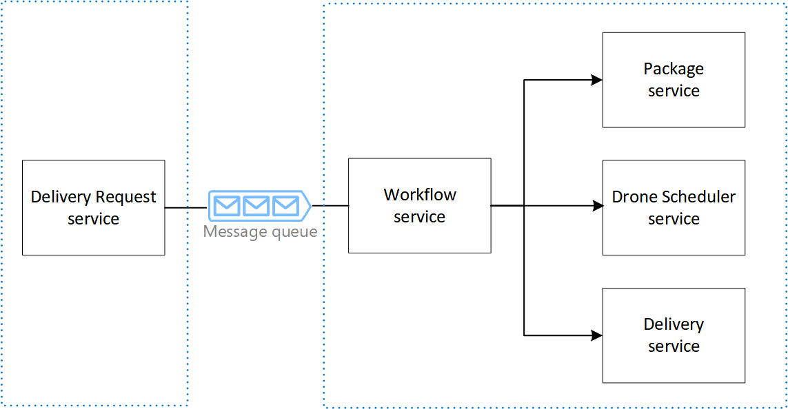

# Microservices Reference Implementation
Microsoft patterns & practices

This reference implementation shows a set of best practices for building and running a microservices architecture on Microsoft Azure, using Azure Service Fabric.

## Guidance

This project has a companion set of articles that describe challenges, design patterns, and best practices for building microservices architecture. You can find these articles on the Azure Architecture Center:

- [Microservices architecture on Azure Service Fabric](https://docs.microsoft.com/en-us/azure/architecture/reference-architectures/microservices/service-fabric)

## Scenario

​Fabrikam, Inc. (a fictional company) is starting a drone delivery service. The company manages a fleet of drone aircraft. Businesses register with the service, and users can request a drone to pick up goods for delivery. When a customer schedules a pickup, a backend system assigns a drone and notifies the user with an estimated delivery time. While the delivery is in progress, the customer can track the location of the drone, with a continuously updated ETA.

## The Drone Delivery app

The Drone Delivery application is a sample application that consists of several microservices. Because it's a sample, the functionality is simulated, but the APIs and microservices interactions are intended to reflect real-world design patterns.

|Service (Folder)|Description|
|---|---|
|Delivery Request service (src\Ingestion)| A stateless service that receives client requests and buffers them by using a Service Bus queue.|
|Workflow service (src\Workflow)| A stateless service that dispatches client requests and manages the delivery workflow.|
|Drone Scheduler service (src\GuestExeWrapper, src\dronescheduler) | A guest executable (Java) that schedules drones and monitors drones in flight.| 
|Package service (src\PackageService)| A stateless service that creates and updates packages. The service persists the packages in a Cosmos DB database.|
|Delivery service (src\DeliveryService)| A stateful service that manages deliveries that are scheduled or in-transit. The partition scheme used is ranged partitioning (UniformInt64Partition).|
|Load tests (src\ingress)| Includes a load test project that executes performance tests on the Delivery Request service |
|azuredeploy-keyvault.json | Defines resources required to create the Key Vault.|
|azuredeploy.json| Defines all the Azure resources required to deploy the reference implementation.|

Each service is packaged into a separate Service Fabric application for greater granularity and easier upgrades. This approach allows all services to be upgraded independently, which is a key tenet of the microservices architecture. A failed upgrade deployment of one service does not block other upgrades.

## Request flow
On receiving a request, the Delivery Request service creates an internal request and sends it to a Service Bus Queue. Every time a new message arrives in the queue, the Workflow service gets a notification. Then, the Workflow service:
- Sends the package information to the Package service through a PUT request. The Package service adds the package (or updates the specified package) in an Azure Cosmos DB collection. In response the Package service returns the add/updated package.
- Creates a delivery object with drop-off and pickup location and sends a PUT request to the Drone Scheduler service to assign a drone to deliver the package. In response, the service returns the identifier of the assigned drone.
- Creates a delivery schedule based on the delivery request and sends a PUT request to the Delivery service. In response, the service indicates whether the delivery was created.

## Node type configuration
The Service Fabric cluster is a 20-node cluster with three node types. The template uses placement constraints to run specific services on certain node types. 

- **system** - A virtual machine scale set with 5 nodes. The nodes run the Service Fabric system services. The durability tier is Bronze. The VM SKU is Standard_D4s_v3. 
- **frontend** - A virtual machine scale set with 5 nodes. Each node runs an instance of the Delivery Request service. The durability tier is Bronze. The VM SKU is Standard_D4s_v3. 
- **backend** - A virtual machine scale set with 10 nodes. Each node runs and instance of Workflow, Drone Scheduler, and Package services. The Delivery service has 50 partitions. Each partition has 3 replicas; one primary and two secondary replicas.

## Network configuration
Azure API Management (APIM) serves as the ingress to the Service Fabric cluster. It routes requests from clients to the  Delivery Request service to start the delivery request. It also routes requests to the Delivery service to get the status of the delivery.

The communication protocol for service-to-service communication is HTTP. All services except the Workflow Service expose HTTP endpoints.

The services communicate with each other over HTTP by using the built-in Service Fabric reverse proxy service. This service is enabled on all virtual machine scale sets and every node is capable of service resolution and connecting with other services that expose HTTP endpoints.

## Monitoring extensions

The Service Fabric cluster is configured to use these extensions for monitoring purposes.

- IaaSDiagnostics VM extension is installed on all virtual machine scale sets that are mapped to node types. This is used to collect ETW/manifests system and operational events, related to Service Fabric reliable services and system services.

    The diagnostic data is stored in a storage account. The data can be viewed by using several tools. For more information,  see [Tools to view diagnostic data](https://docs.microsoft.com/azure/azure-monitor/platform/diagnostics-extension-to-storage#tools-to-view-diagnostic-data).

    The stored data is analyzed in Log Analytics.

- MicrosoftMonitoringAgent extension is configured to send Windows event logs, performance counterss to Log Analytics.

To capture the flow of events across all services, the reference implementation uses the Application Insights SDK to enable distributed tracing. As requests are routed to the Delivery Request service, Application Insights injects correlation information in the request. When the service forwards the request to Service Bus, correlation information is added to the metadata of each message. The Workflow service implements a tracing extension class to help propagate that information before passing the request to other downstream services. This way, the hierarchical correlation data is collected for the entire transaction and can be useful in monitoring end-to-end operational metrics.

## Deployment

To deploy the solution, follow the steps listed [here](./deployment.md) to get deep understanding on the infrastructure or [just use ARM templates](./deployment.md).

---

This project has adopted the [Microsoft Open Source Code of Conduct](https://opensource.microsoft.com/codeofconduct/). For more information see the [Code of Conduct FAQ](https://opensource.microsoft.com/codeofconduct/faq/) or contact [opencode@microsoft.com](mailto:opencode@microsoft.com) with any additional questions or comments.
